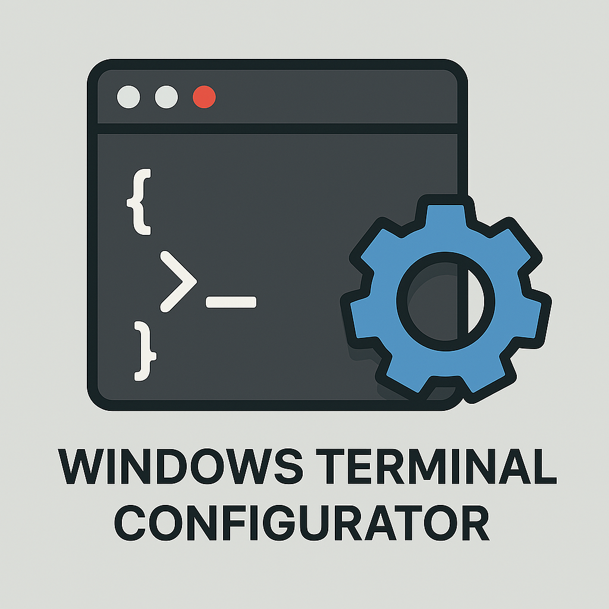

# Windows Terminal Manager

A powerful PyQt6 GUI application for visually managing Windows Terminal settings, profiles, color schemes, keybindings, and complex command generation.



## Features

### Profile Management
- **Visual Profile Editor**: Edit all profile properties in one place
  - Name, command line, starting directory, tab title
  - **Tab Color Picker**: Visual color selector for tab identification
  - Icon customization with file browser
  - Font face and size selection
  - Background image with opacity control
  - Cursor shape and scrollbar settings
  - Run as administrator option
- **Profile Organization**: Reorder, rename, duplicate, and delete profiles
- **Set Default Profile**: Quick access to change your default terminal profile

### Folder & New Tab Menu
- **Hierarchical Menu Structure**: Create folders to organize your profiles
- **Visual Tree Editor**: Drag-and-drop interface for menu organization
- **Custom Icons**: Add icons to folders and profile entries
- **Separators**: Visual dividers for menu sections
- **Inline Options**: Control folder display behavior

### Color Schemes
- **Scheme Editor**: Modify all 16 ANSI colors, foreground, background, cursor colors
- **Visual Color Picker**: Click any color to open a color selection dialog
- **Scheme Management**: Create, duplicate, rename, and delete color schemes
- **Live Preview**: See changes as you edit

### Keybindings & Actions
- **Action Editor**: Configure keyboard shortcuts for ~30+ Windows Terminal actions
- **Multi-Key Bindings**: Support for complex key combinations
- **Quick Search**: Filter actions by name
- **Common Actions**: Pre-populated list of all standard WT actions

### WT Command Builder
- **Visual Command Generator**: Build complex `wt.exe` commands without memorization
- **Multi-Tab/Pane Support**: Create commands with multiple tabs and split panes
- **Command Parser**: Paste existing commands to edit them visually
- **Step-by-Step Building**: Add tabs and panes with visual controls
- **One-Click Copy**: Generate and copy commands to clipboard

## Installation

### Requirements
- Windows 10/11
- Windows Terminal (Microsoft Store or GitHub release)
- Python 3.10 or higher
- PyQt6
- commentjson
- matplotlib (for font enumeration)

### Install Dependencies

```powershell
pip install PyQt6 commentjson matplotlib
```

### Download

Clone the repository:
```powershell
git clone https://github.com/RafalekS/windows-terminal-mgr.git
cd windows-terminal-mgr
```

Or download the latest release.

## Usage

### Basic Usage

Run the application:
```powershell
python wt_manager.pyw
```

### Debug Mode

Enable detailed console output for troubleshooting:
```powershell
python wt_manager.pyw --debug
```

### Workflow

1. **Launch the application** - It automatically loads your Windows Terminal settings
2. **Make changes** - Edit profiles, schemes, folders, or actions
3. **Click Save** - Changes are written to `settings.json` with automatic backup
4. **Test in Windows Terminal** - Your changes are immediately available

### Automatic Backups

Every time you save, the application creates a timestamped backup:
```
settings.json.bak_20250102_143052
```

Backups are stored in the Windows Terminal settings directory:
```
%LOCALAPPDATA%\Packages\Microsoft.WindowsTerminal_8wekyb3d8bbwe\LocalState\
```

## Tab Color Feature

The tab color feature helps you visually distinguish different profile tabs in Windows Terminal.

**To set a tab color:**
1. Go to **Profiles** tab
2. Select a profile from the list
3. Scroll to **Tab Color** field
4. Either:
   - Type a color manually: `#FF5733`, `#F73`, `rgb(255,87,51)`
   - Click **Pick Color...** to use the visual color picker
5. Click **Save**


## File Structure

```
windows-terminal-mgr/
├── wt_manager.pyw          # Main application
├── WT_config.ico           # Application icon
├── WT_config.png           # Application icon (PNG)
├── wt3.ico                 # Fallback icon
├── CLAUDE.md               # Developer documentation
├── README.md               # This file
├── .gitignore              # Git ignore rules
└── help/                   # Documentation folder
    ├── wt_manager_fixes_todo.md
    ├── wt_manager_fixes_completed.md
    ├── tests.md
    └── folder_fixes_summary.txt
```

## Development

### Architecture

Single-file PyQt6 application (~2900 lines) with four main tabs:
- **Profiles Tab**: Profile property editor
- **Folders Tab**: New tab menu hierarchy manager
- **Actions Tab**: Keybinding configuration
- **Command Builder Tab**: Visual WT command generator

See [CLAUDE.md](CLAUDE.md) for detailed architecture documentation.

### Adding Features

The code follows a consistent pattern:
1. Add UI elements in `setupXXXTab()` methods
2. Connect signals to handler methods
3. Update `changedProfile()` or equivalent loader method
4. Implement change handler to update `data_schemes` dictionary

### Testing

Always test with debug mode to see detailed state changes:
```powershell
python wt_manager.pyw --debug
```

## Troubleshooting

### Icon Not Loading
- Ensure `WT_config.ico` is in the same directory as `wt_manager.pyw`
- Check console for error messages

### Changes Not Saving
- Verify Windows Terminal is not running (it may lock `settings.json`)
- Check debug output for "Entry not found" warnings
- Restore from backup if needed

### Settings Not Loading
- Ensure Windows Terminal is installed
- Check that settings.json exists in the expected location
- Run with `--debug` to see the detected settings path

## Known Issues

See [help/wt_manager_fixes_todo.md](help/wt_manager_fixes_todo.md) for current known issues and planned improvements.

## Contributing

Contributions are welcome! Please:
1. Fork the repository
2. Create a feature branch
3. Test thoroughly with `--debug` mode
4. Submit a pull request

## License

This project is provided as-is for personal use. Feel free to modify and distribute.

## Acknowledgments

- Built with [PyQt6](https://www.riverbankcomputing.com/software/pyqt/)
- Uses [commentjson](https://github.com/vaidik/commentjson) for JSON-with-comments parsing
- Icon design by Rafal Staska

## Contact

- GitHub: [@RafalekS](https://github.com/RafalekS)
- Repository: [windows-terminal-mgr](https://github.com/RafalekS/windows-terminal-mgr)

---

**Note**: This application directly modifies Windows Terminal's `settings.json` file. While automatic backups are created, always ensure you have your own backups of important configurations.
